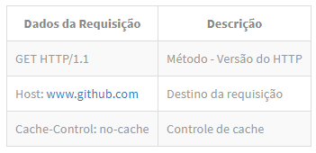
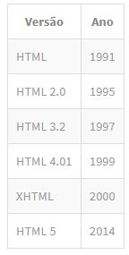

# PROJETO PRÁTICO - Desenvolvendo um site do zero com HTML e CSS

https://www.schoolofnet.com/projeto-pratico/frontend/html/desenvolvendo-um-site-do-zero-html-css/

---

## <a name="indice">Índice</a>

- [Protocolo HTTP](#parte1)   
- [Introdução ao HTML](#parte2)   
- [Hello World HTML](#parte3)   
- [Marcando as principais sessões do nosso projeto](#parte4)   
- [Marcando o cabeçalho mais a fundo](#parte5)   
- [Trabalhando com fontes, cores e fundo](#parte6)   
- [Posicionando os elementos](#parte7)   
- [Estilizando os links](#parte8)   
- [Conhecendo a W3Schools](#parte9)   
- [Organizando os estilos CSS](#parte10)   
- [Marcando a sessão "Como funciona"](#parte11)   
- [Estilizando a sessão "Como funciona"](#parte12)   
- [Trabalhando com ícones](#parte13)   
- [Marcando a sessão "Nossos clientes"](#parte14)   
- [Estilizando a sessão "Nossos clientes"](#parte15)   
- [Marcando a sessão "Nossa equipe"](#parte16)   
- [Estilizando a sessão "Nossa equipe"](#parte17)   
- [Marcando a sessão "Rodapé"](#parte18)   
- [Estilizando a sessão "Rodapé"](#parte19)   
- [Refatorando o CSS para várias páginas](#parte20)   
- [Criando a página quem somos](#parte21)   
- [Criando as páginas clientes e equipe](#parte22)   
- [Criando a página de contato - Trabalhando com formulários](#parte23)   
- [Estilizando a página de contato](#parte24)   
- [Criando a página de produtos](#parte25)   
- [Box flutuante com descrição do membro do time](#parte26)   
- [Meta tag Viewport](#parte27)   
- [Trabalhando com Media Types](#parte28)   
- [Adaptando layout para mobile](#parte29)   
- [Checando compatibilidade entre navegadores](#parte30)   
- [Enviando email](#parte31)   
- [Manipulando comportamentos](#parte32)   
- [Minificando CSS](#parte33)   
- [Publicando o projeto](#parte34)   
- [Acertando botão do formulário de contato](#parte35)   
- [Configurando Twitter Bootstrap](#parte36)   
- [Conhecendo o Twitter Bootstrap](#parte37)   
- [Marcando menu lateral](#parte38)   
- [Estilizando menu lateral](#parte39)   
- [Status online e botão de ação](#parte40)   
- [Marcando conteúdo](#parte41)   
- [Trabalhando com ícones do Twitter Bootstrap](#parte42)   
- [Finalizando o projeto](#parte43)   

---

## <a name="parte1">Protocolo HTTP</a>

#### Protocolo HTTP

No conteúdo, completo, deste tema, mostraremos como criar uma site do zero, utilizando HTML e CSS.

Neste módulo, passaremos algumas informações iniciais como o protocolo HTTP, antes de falar do layout e outros detalhes mais característicos do projeto que desenvolveremos.

Antes mesmo de pegarem um layout em PSD e começarem a montar o layout com html e css, vocês precisam saber um pouco sobre o protocolo HTTP.

Este protocolo tem assunto suficiente para uns dois módulos. Falaremos, apenas, o básico, necessário para a criação de um web site.

#### O que é HTTP

"O Hypertext Transfer Protocol(HTTP), em português Protocolo de Transferência de Hipertexto. É um protocolo de comunicação (na camada de aplicação, segundo o Modelo OSI), utilizado para sistemas de informação de hipermídia, distribuídos e colaborativos. Ele é a base para a comunicação de dados da World Wide Web." - Wikipedia

Resumindo, o HTTP é um protocolo que transmite texto. Com este texto, o navegador consegue se conectar com computadores na internet, que são chamados servidores, e destes servidores, ele recebe uma resposta de um processamento interno.

http_request_response

Nesta imagem, vocês podem observar como o protocolo funciona.

O Client Browser é o navegador do cliente, que está acessando o web site. Quando ele acessa, está emitindo uma Request, através do protocolo HTTP, que vai até o servidor onde você disponibilizou o site. Este servidor processa as informações e retorna para o browser, através de uma Response, utilizando o protocolo, novamente.

Existem servidores que utilizam apache, nginx e outros que são disponibilizados.

Quando vocês digitam no browser, o endereço de uma site e teclam enter, além do endereço, estão enviando diversos, outros, dados para o servidor. Este servidor processará todos eles e depois retornará a página do site, já renderizada, ou um erro, caso os dados enviados, estejam incorretos.

#### Dados de requisição e resposta

Dados da Response | Descrição HTTP/1.1 | Versão do HTTP Server: GitHub.com | Nome do servidor Date: Tue, 28 Mar 2017 19:15:31 GMT | Date e hora do servidor Content-Type: text/html; charset=utf-8 | Cabeçalho com tipo do conteúdo Transfer-Encoding: chunked | Tipo de transferência Status 200 OK | Status Code Cache-Control: no-cache | Controle de cache

Existem vários métodos que podem ser enviados através do HTTP:

GET - POST - PUT - DELETE - OPTIONS - HEAD - TRACE - CONNECT

Se vocês já possuem certa experiência com desenvolvimento de site, conhecem bem os métodos get e post. Se tiverem mais experiência em API RESTfull, por exemplo, vão conhecer, além do get e post, o put e o delete. Às vezes, o options, também é utilizado, mas ainda causa algumas dúvidas em algumas APIs, porque deve ser habilitado no servidor, mas isso não vem ao caso, neste momento.

Falaremos mais, sobre get e post, que são utilizados para web sites.

Quando temos um formulário no site e enviamos os dados deste formulário para o servidor, temos duas opções: get e post. A diferença entre os métodos é que, o get mostra os dados enviados na url e o post, omite, estes dados. O envio será feito da mesma forma, a grande diferença é o fato de, mostrar ou não, os dados na url. Se os dados não forem confidenciais e não houver problema em mostrá-los, na url, vocês podem utilizar o get, sem problema algum.

O resto dos métodos HTTP, vocês não precisam se atentar, basta saberem que existem. Se um dia forem estudar, já sabem que existe e já tem um princípio para os estudos.

#### Headers

Até agora, citamos o cache-control e o content-type, mas existem muitos outros tipos de cabeçalhos que podem ser retornados pelo servidor. Cada header tem uma regra diferente e, manipula como os dados transitarão durante as requests e responses. O Content-Type, por exemplo, serve para falar para o servidor qual o tipo de dado que está sendo enviado ou para o servidor informar qual o tipo de dado que está sendo retornado.

Vocês podem encontrar uma lista, completa, acessando o link abaixo:

https://pt.wikipedia.org/wiki/Lista_de_campos_de_cabe%C3%A7alho_HTTP

####Conclusão

O mais importante deste módulo é entenderem o papel do HTTP, que está ilustrado na primeira imagem. Não se preocupem, por enquanto, com os verbos HTTPs e outras informações, mais técnicas.

Falaremos mais sobre os protocolos, em módulos futuros, sempre que for necessário.

No próximo módulo falaremos da teoria envolvida na linguagem de marcação HTML. Somente, depois disso, que começaremos a colocar a mão na massa, em nosso projeto prático.

[Voltar ao Índice](#indice)

---

## <a name="parte2">Introdução ao HTML</a>

#### Introdução ao HTML

No módulo anterior, falamos como é feita a comunicação entre o navegador e o servidor. Falamos que o servidor emite uma resposta para o navegador e é sobre isso que falaremos, neste módulo.

Esta resposta, pode conter uma estrutura HTML para ser renderizada no navegador.

Um exemplo é o Facebook. A estilização da cor azul, o chat e todos os botões, são respostas do servidor do Facebook, que foi renderizada pelo navegador.

Não importa qual a linguagem que estejam utilizando no servidor, para retornar a response para o browser. O que importa saber é que, sempre, receberemos uma página HTML, como resposta. Este HTML definirá a estrutura da página.

Pode até parecer complicado, mas quando começarmos a trabalhar, na prática, vocês entenderão.

####O que é HTML

"HTML (abreviação para a expressão inglesa HyperText Markup Language, que significa Linguagem de Marcação de Hipertexto). É uma linguagem de marcação, utilizada na construção de páginas web. Documentos HTML podem ser interpretados por navegadores." - Wikipedia

Quando vocês analisam um web site, por mais que não queriam, estão vendo o HTML, o tempo todo. Quando vocês vêem um logo, em um site, existe uma estrutura, reservando aquele local para o logo. O menu, tem um local reservado para ele, também.

Todo texto e imagem de uma site, tem um estrutura por trás, ou seja, quando precisamos criar um layout, temos que fazer toda marcação, básica, com o HTML. Depois, aplicamos o CSS, para melhorar o layout. A parte de estruturação pesada, é feita pelo HTML.

Existem algumas seções que são muito conhecidas em websites. São estruturas que, a grande maioria dos sites tem, que são: header, content, footer e sidebar. Quando falamos em layout, estes nomes são bem conhecidos. Existem as sub-seções, que para exemplificar, podemos falar do logo e do menu, que estão, geralmente, na seção header, nos layouts padrões.

Pode ser que existam layouts que fujam desta padronização, mas sempre serão divididos em seções. Quando vocês já possuem alguma experiência, enxergam estes blocos de cara, só de olhar um site, já identificam as seções que ele possui.

Esta é a função do HTML, marcar as seções e definir onde estará cada elemento do nosso layout.

Utilizaremos o HTML 5 para desenvolver nosso projeto. Desde 2014 que esta versão está no mercado e, atualmente, a maioria dos desenvolvedores a utiliza.

Vejam a evolução da linguagem HTML:

Existe um elemento, chamado doctype, que informa ao navegador, que utilizaremos a versão HTML 5.

Observem que temos o elemento doctype. Em seguida, temos a abertura da tag html informando a linguagem que será utilizada. A tag html é aberta no início e fechada, somente, no final. Dentro desta tag, temos dois elementos que são: head e body.

O head possui dados que são "ocultos" ao usuário e o body é a parte visível da página, que todos os usuários terão acesso.

A tag title, que está dentro da head, é possível visualizar nas abas. Quando vocês acessam o Facebook, por exemplo, vocês podem ver na aba do navegador, um título.

Notem que existe a meta tag, com o parâmetro utf-8, que é um tipo de codificação da nossa estrutura. Esta codificação é a mais completa e nos permite trabalhar com acentos, normalmente, sem a quebra do layout.

Toda página que forem criar, utilizará a mesma estrutura HTML, acima. Vocês podem salvar, em algum local, para ganharem tempo. Algumas IDEs trazem um atalho, para a geração desta estruta básica.

O próximo passo será colocar a mão na massa e praticar.

[Voltar ao Índice](#indice)

---

## <a name="parte3">Hello World HTML</a>

[Voltar ao Índice](#indice)

---

## <a name="parte4">Marcando as principais sessões do nosso projeto</a>

[Voltar ao Índice](#indice)

---

## <a name="parte5">Marcando o cabeçalho mais a fundo</a>

[Voltar ao Índice](#indice)

---

## <a name="parte6">Trabalhando com fontes, cores e fundo</a>

[Voltar ao Índice](#indice)

---

## <a name="parte7">Posicionando os elementos</a>

[Voltar ao Índice](#indice)

---

## <a name="parte8">Estilizando os links</a>

[Voltar ao Índice](#indice)

---

## <a name="parte9">Conhecendo a W3Schools</a>

[Voltar ao Índice](#indice)

---

## <a name="parte10">Organizando os estilos CSS</a>

[Voltar ao Índice](#indice)

---

## 

[Voltar ao Índice](#indice)

---

## 

[Voltar ao Índice](#indice)

---

## 

[Voltar ao Índice](#indice)

---

## 

[Voltar ao Índice](#indice)

---

## 

[Voltar ao Índice](#indice)

---

## 

[Voltar ao Índice](#indice)

---

## 

[Voltar ao Índice](#indice)

---

## 

[Voltar ao Índice](#indice)

---

## 

[Voltar ao Índice](#indice)

---

## 

[Voltar ao Índice](#indice)

---
